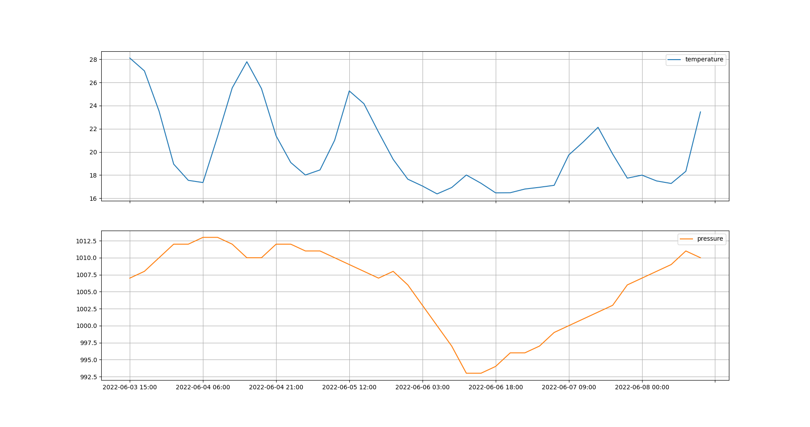

+++
title = "Temperature and pressure forecasting program in Python"
slug = "forecast"
date = "03 Jun 2022"
[ author ]
name = "Suhito Sagara"
+++

　I feel headache and lethargy when the atmospheric pressure drops suddenly, so I created this app hoping to forecast the atmospheric pressure.

　There are many weather forecasting apps and services, but I couldn't find a free service that provides a relatively long-term (5 days) atmospheric pressure forecast.

　OpenWeatherMap is an overseas company, but it seems to cover Japanese cities to some extent.

　By specifying the obtained API key and the city name or latitude and longitude in the program, the following graph of temperature and pressure is drawn.

　By viewing this graph together with the temperature graph, we can predict that June 6 is likely to be a very stormy day with low temperatures and low pressure.

　We would like to add more functions such as displaying daily weather forecasts as icons, but we have uploaded the project to GitHub.

　[forecast](https://github.com/1plus1is3/forecast)
