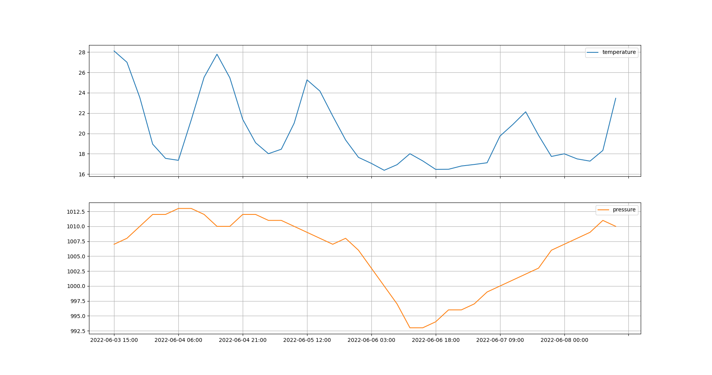

+++
title = "Pythonで気温・気圧予報プログラムを書きました"
slug = "forecast"
date = "03 Jun 2022"
[ author ]
name = "相良　スヒト"
+++

　私は気圧が急激に下がると頭痛やだるさを覚えるので、気圧を予報できればいいなと思ってつくったものです。

　天気予報のアプリやサービスは数多くありますが、5日間という比較的長期の気圧予報を無料で見られるサービスは見当たりませんでした。

　OpenWeatherMap社は海外の企業ですが、日本の都市もある程度カバーしているようです。

　取得したAPIキーとプログラム内で都市名または緯度・経度を指定することで、以下のような気温・気圧のグラフを描画します。

　気温グラフと合わせて見ることで、6月6日が気温・気圧ともに低く、大荒れの天気らしいことが予測されます。

　日ごとの天気予報をアイコンで表示するなど、まだまだ機能を足したいところではありますが、一旦GitHubへもアップロードしました。

　[forecast](https://github.com/1plus1is3/forecast)
